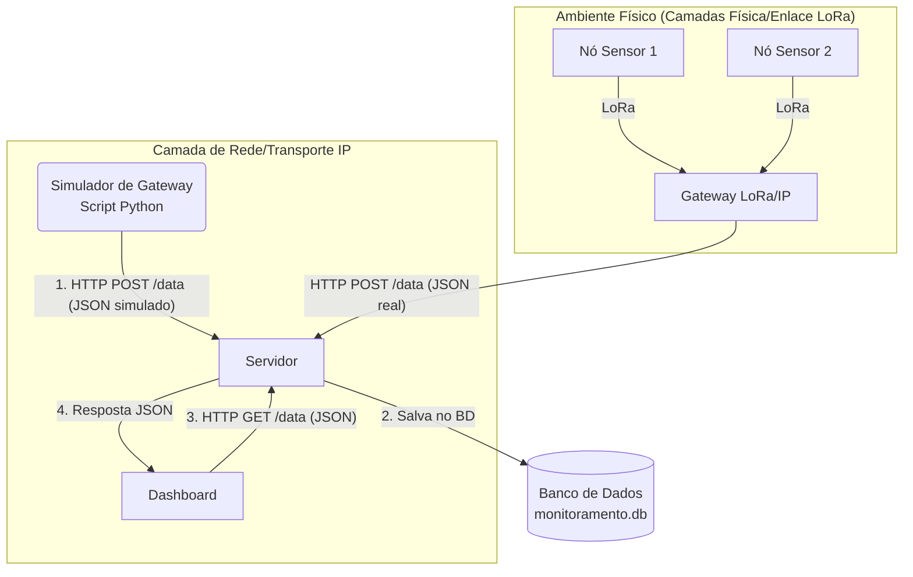

```mermaid
graph TD;
    subgraph "Camada de Rede/Transporte IP"
        Srv[Servidor]
        Dash[Dashboard]
        Sim(Simulador de Gateway<br>Script Python)
    end

    subgraph "Ambiente Físico (Camadas Física/Enlace LoRa)"
        G[Gateway LoRa/IP]
        SN1[Nó Sensor 1]
        SN2[Nó Sensor 2]
    end

    %% Conexões do Protótipo Lógico (Entregável 1)
    Sim --"1. HTTP POST /data (JSON simulado)"--> Srv
    Dash --"3. HTTP GET /data (JSON)"--> Srv
    Srv --"4. Resposta JSON"--> Dash
    Srv --"2. Salva no BD"--> DB[(Banco de Dados<br>monitoramento.db)]
    
    %% Conexões da Arquitetura Completa (Futura)
    SN1 --"LoRa"--> G
    SN2 --"LoRa"--> G
    G --"HTTP POST /data (JSON real)"--> Srv
```